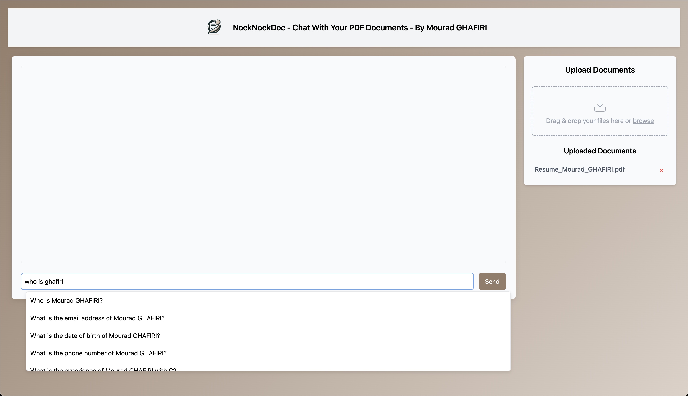
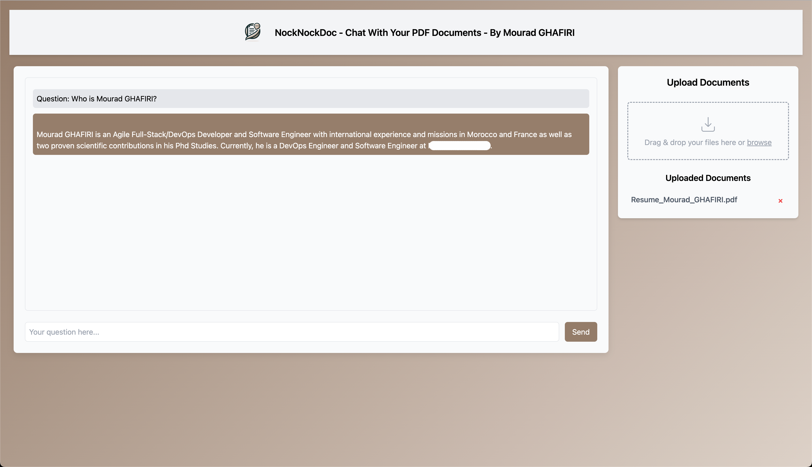
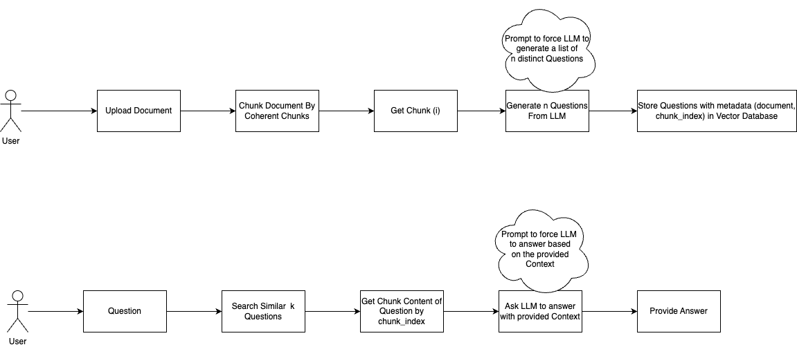

#### This is an experimental and alternative approach to Finetuning and RAG.

The approach is to anticipate the possible questions/queries about a content instead of doing fine-tuning or RAG.

You can call the approach:
- LLM-indexing
- GPT-Indexing
- Or propose a name for it :)





I believe that RAG is a powerful approach, but I think it is not the right direction for LLM applications.

LLMs are powerful enough to generate all possibles questions/queries/keywords about a content, even questions that a human can't think of.

Therefore the approach's idea is to let the LLM generate a list of n questions for a given content then embed/store those questions in a vector database. Once we have those questions pre-processed and stored we can then do similar search from user's question against the LLM generated questions.

The approach can provide to the user possible questions to ask through an autocomplete/similarity




The application uses
- llama-cpp-python: to load and infer the LLM model.
- sentence-transformers: for word-2-vec (word embeddings)
- chromadb: as Vector database
- FastAPI: to expose APIs and Socket
- pypdf: To parse pdf

To install dependencies:
```bash
pip install -r requirements.txt
```

I used mistral-7b-instruct-v0.1, you can download the gguf of it from huggingface or using LM Studio.

Change the Configuraion in the src/config.py
```python
...
LLM_MODEL_FILE_PATH = "path/to/mistral-7b-instruct-v0.1.Q8_0.gguf"
...

```

Run the application

```bash
uvicorn main:app
```

Navigate to: http://127.0.0.1:8000


### Notes
- We can also use this approach to pre-summarize chunks and provided them as context.
- We can reduce the context by summarization and pre-generate more questions on summaries
- We can do parallel indexing


### Important information
The code and application architecture is a quick and dirty Proof Of Concept.
I did not write a single line of code, the whole code is generated by ChatGPT-4, under my direction, with small adaptations.

### Cons:
No approach is Perfect, among the Cons:
- Slow to do indexing, but with more fast models and multi processing.
- You can discover more, it is research :)

### License
The Mistral model is an MIT license model.
The code and the approach I propose is also in MIT License.
Feel free to improve or contribute.
